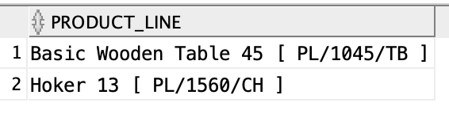
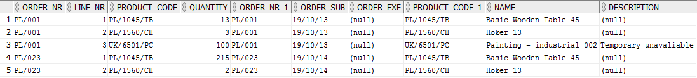
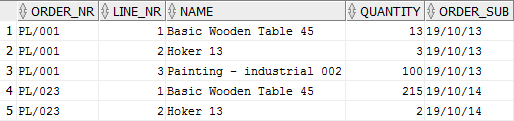
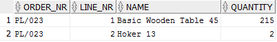

### Order
Table creation - DDL (Data Definition Language) SQL

    -- DROP TABLE ANIA.ORDERS;
    CREATE TABLE "ANIA"."ORDERS" 
    (	
    "ORDER_NR" VARCHAR2(25 CHAR), 
    "ORDER_SUB" DATE, 
    "ORDER_EXE" DATE,
    CONSTRAINT PK_ORDERS PRIMARY KEY(ORDER_NR)
    );

Inserting - DML (Data Modification Language) SQL

    INSERT INTO ANIA.ORDERS (ORDER_NR, ORDER_SUB) VALUES ('PL/001', TO_DATE('13-10-2019', 'DD-MM-YYYY'));
    INSERT INTO ANIA.ORDERS (ORDER_NR, ORDER_SUB) VALUES ('PL/023', TO_DATE('14-10-2019', 'DD-MM-YYYY'));
    INSERT INTO ANIA.ORDERS (ORDER_NR, ORDER_SUB) VALUES ('PL/013', TO_DATE('15-10-2019', 'DD-MM-YYYY'));

---

### Product
Table creation - DDL (Data Definition Language) SQL

    CREATE TABLE ANIA.PRODUCTS 
    (
      PRODUCT_CODE  VARCHAR2(20)    NOT NULL, 
      NAME          VARCHAR2(50)    NOT NULL, 
      DESCRIPTION   VARCHAR2(300), 
      CONSTRAINT PK_PRODUCTS PRIMARY KEY(PRODUCT_CODE)
    );

Inserting - DML (Data Modification Language) SQL

    INSERT INTO ANIA.PRODUCTS (PRODUCT_CODE, NAME) VALUES ('PL/1045/TB', 'Basic Wooden Table 45');
    INSERT INTO ANIA.PRODUCTS (PRODUCT_CODE, NAME) VALUES ('PL/1560/CH', 'Hoker 13');
    INSERT INTO ANIA.PRODUCTS (PRODUCT_CODE, NAME) VALUES ('UK/6501/PC', 'Painting - industrial 002');

Querying - select all

    SELECT * FROM ANIA.PRODUCTS;

Querying - select custom name from PL products

    SELECT NAME || ' [ ' || PRODUCT_CODE || ' ]' "PRODUCT_LINE"
    FROM ANIA.PRODUCTS
    WHERE PRODUCT_CODE LIKE 'PL%';

---

### Order lines
Table creation - DDL (Data Definition Language) SQL

    CREATE TABLE "ANIA"."ORDER_LINES" 
    (	
    "ORDER_NR" VARCHAR2(25 CHAR) NOT NULL, 
    "LINE_NR" NUMBER (20) NOT NULL,
    "PRODUCT_CODE" VARCHAR2(20 CHAR) NOT NULL,
    "QUANTITY" NUMBER (10),

    CONSTRAINT PK_ORDER_LINES PRIMARY KEY(ORDER_NR , LINE_NR),
    CONSTRAINT FK_ORDER_LINES_PRODUCTS FOREIGN KEY(PRODUCT_CODE) REFERENCES ANIA.PRODUCTS(PRODUCT_CODE),
    CONSTRAINT FK_ORDER_LINES_ORDERS FOREIGN KEY(ORDER_NR) REFERENCES ANIA.ORDERS(ORDER_NR)
    );
    
Inserting - DML (Data Modification Language) SQL

    INSERT INTO ANIA.ORDER_LINES (ORDER_NR, LINE_NR, PRODUCT_CODE, QUANTITY) VALUES ('PL/001', 1 , 'PL/1045/TB' , 13) ;
    INSERT INTO ANIA.ORDER_LINES (ORDER_NR, LINE_NR, PRODUCT_CODE, QUANTITY) VALUES ('PL/001', 2 , 'PL/1560/CH' , 3) ;
    INSERT INTO ANIA.ORDER_LINES (ORDER_NR, LINE_NR, PRODUCT_CODE, QUANTITY) VALUES ('PL/001', 3 , 'UK/6501/PC' , 100) ;
    INSERT INTO ANIA.ORDER_LINES (ORDER_NR, LINE_NR, PRODUCT_CODE, QUANTITY) VALUES ('PL/023', 1 , 'PL/1045/TB' , 215) ;
    INSERT INTO ANIA.ORDER_LINES (ORDER_NR, LINE_NR, PRODUCT_CODE, QUANTITY) VALUES ('PL/023', 2 , 'PL/1560/CH' , 2) ;

Updating - DML SQL
    
    UPDATE ANIA.PRODUCTS 
    SET DESCRIPTION = 'Temporary unavaliable'
    WHERE product_code = 'UK/6501/PC';

Delete - DML SQL

    DELETE FROM ANIA.PRODUCTS
    WHERE PRODUCT_CODE = 'PL/1445/CH';
    
Joining 

    -- Joining whole tables
    SELECT * FROM ANIA.ORDER_LINES OL
    JOIN ORDERS O ON O.ORDER_NR = OL.ORDER_NR
    JOIN PRODUCTS P ON P.PRODUCT_CODE = OL.PRODUCT_CODE;

    
    -- Joining selected columns
    SELECT OL.ORDER_NR, OL.LINE_NR, P.NAME, OL.QUANTITY, O.ORDER_SUB FROM ANIA.ORDER_LINES OL
    JOIN ORDERS O ON O.ORDER_NR = OL.ORDER_NR
    JOIN PRODUCTS P ON P.PRODUCT_CODE = OL.PRODUCT_CODE;

    --Joining columns: selected column P.NAME is from PRODUCTS table. The ORDER_LINES table is joined with the PRODUCTS table via primary key
    --In result it is possible to select the NAME column from PRODUCTS even though it is not a foreign key
    
    SELECT OL.ORDER_NR, OL.LINE_NR, P.NAME, OL.QUANTITY FROM ANIA.ORDER_LINES OL
    JOIN ORDERS O ON O.ORDER_NR = OL.ORDER_NR
    JOIN PRODUCTS P ON P.PRODUCT_CODE = OL.PRODUCT_CODE
    WHERE O.ORDER_SUB=TO_DATE('20191014','YYYYMMDD');

   

    SELECT NLS_TERRITORY, CUST_LAST_NAME FROM OE.CUSTOMERS
    WHERE EXTRACT(MONTH FROM
    TO_DATE(DATE_OF_BIRTH, 'DD-MON-RR')) = 06 ;
   
   
